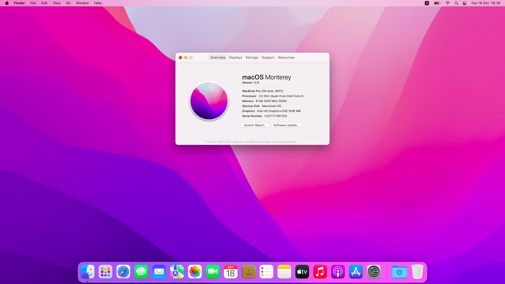

# Y520-15IKBN-OpenCore

<b>Ready-to-use OpenCore 0.8.5 EFI for Lenovo Legion Y520-15IKBN</b>

> ❓ If you don't know how to use this EFI, please refer to this [guide](https://dortania.github.io/OpenCore-Install-Guide/) 

> ⚠️ If you want to use this EFI with your Apple ID, please refer to this [guide](https://youtu.be/JtYAAjgniIc) (but generate serial for MacBookPro14,3 not MacPro6,1) to avoid any problems

## ☑️ Tested versions
| macOS | OpenCore | Works? | EFI |
| :---: | :---: | :---: | :---: |
| Monterey 12.6 | 0.8.5 | ✅ | [Download](https://github.com/ferxiit/Y520-15IKBN-OpenCore/releases/download/monterey/EFI_Monterey.zip) | 

## 🔘 Status
| Feature | Works? | Notes |
| :---: | :---: | :---: |
| **Built-in Wi-Fi & Bluetooth** | ✅ | Works also in macOS Recovery |
| **Ethernet** | ✅ | - |
| **Intel GPU (iGPU)** | ✅ | - |
| **Audio** | ✅ | - |
| **Microphone** | ✅ | - |
| **Webcam** | ✅ | - |
| **External display via HDMI** | ✅ | - |
| **Build-in keyboard** | ✅ | - |
| **Trackpad** | 🔶 Partially | Physical buttons doesn't work and you need to enable "**Tap to click**" in System Preferences
| **USB 2, USB 3 & USB-C** | ✅ | - |
| **Sleep** | ✅ | - |
| **FileVault** | ✅ | - |
| **Battery percentage** | ✅ | - |
| **Nvidia GPU** | ❌ | - |
| **SD Card Reader** | ❌ | - |

## 🔧 BIOS Settings
| Setting | Enabled? |
| :---: | :---: |
| Secure Boot | ❌ |
| Fast Boot | ❌ |
| Intel Virtual Technology | ✅ |
| Intel Platform Trust Technology | ❌ |

## Acknowledgments
**[dortania](https://github.com/dortania/)** for [Dortania's OpenCore Install Guide](https://dortania.github.io/OpenCore-Install-Guide/) 
**[acidanthera](https://github.com/acidanthera)** for [OpenCore](https://github.com/acidanthera/OpenCorePkg) and most of the kexts and drivers 
**[USBToolBox](https://github.com/USBToolBox)** for [USBToolBox & UTBmap](https://github.com/USBToolBox/kext) kexts 
**[OpenIntelWireless](https://github.com/OpenIntelWireless)** for Intel [Wi-Fi](https://github.com/OpenIntelWireless/itlwm) & [Bluetooth](https://github.com/OpenIntelWireless/IntelBluetoothFirmware) kexts 
**[Mieze](https://github.com/Mieze)** for [Realtek RTL8111](https://github.com/Mieze/RTL8111_driver_for_OS_X) kext 
**[1Revenger1](https://github.com/1Revenger1)** for [ECEnabler](https://github.com/1Revenger1/ECEnabler) kext 
**[VoodooSMBus](https://github.com/VoodooSMBus)** for [VoodooRMI](https://github.com/VoodooSMBus/VoodooRMI) kext 
**[jaromeyer](https://github.com/jaromeyer)** for inspiration how to write this ReadMe
